# AWS E-Commerce Data Lakehouse

## What is this?

This is a **data engineering** project. Data engineering sits between your backend (the app, the database) and the people who need to analyze that data (analysts, dashboards, ML models). The job is to move data reliably, transform it into something useful, and make sure it's always fresh and queryable.

You see this kind of system at any company with real data needs — Amazon tracking every order and click, Swiggy understanding drop-off in the checkout funnel, Zepto knowing which SKUs are flying off shelves. The tools differ, the pattern is the same: get data out of the database → clean it → serve it for analysis.

This project simulates that entire pipeline using AWS-native services on an e-commerce dataset (users, orders, clickstream events).

---

## Architecture

> *(diagram coming — will be added here)*

---

## Tech Stack

| Service | What it does in this project |
|---|---|
| **Terraform** | Provisions all AWS infrastructure as code — VPC, RDS, S3, IAM roles. One `terraform apply`, everything is up. |
| **RDS (PostgreSQL)** | The source-of-truth database. Holds users and orders tables, like any e-commerce backend would. |
| **AWS DMS** | Watches the Postgres write-ahead log and ships every INSERT / UPDATE / DELETE to S3 as CSV files. No polling, no cron — it reacts to changes as they happen. |
| **Kinesis + Firehose** | Handles clickstream events (views, clicks, add-to-carts, purchases). Events are streamed in real time, Firehose buffers them and lands GZIP files in S3 every 60 seconds. |
| **AWS Glue (PySpark)** | Three ETL jobs that transform raw S3 data into clean, queryable Iceberg tables. See [Glue Jobs](#glue-jobs) below. |
| **Apache Iceberg** | Table format on top of S3. Gives you UPDATE, DELETE, time-travel queries, and ACID guarantees — things plain Parquet files can't do. |
| **Athena** | Serverless SQL directly over the Iceberg tables. Used to create views for revenue, churn, and conversion funnel. |
| **Redshift Spectrum** | Lets Redshift query S3/Iceberg tables without loading data in. Used for BI workloads and materialized views. |
| **QuickSight** | Dashboards connected to Athena — daily revenue, conversion funnel by referrer, user churn KPIs. |
| **Step Functions** | Orchestrates the three Glue jobs in the right order. If any job fails, the pipeline stops and logs the failure. |
| **Glue Data Quality** | Ruleset on `fact_orders` — checks completeness, uniqueness, row count. Failures publish to CloudWatch. |
| **CloudWatch + SNS** | Alarms on pipeline failures and DQ failures. Sends email via SNS when something breaks. |

---

## Glue Jobs

Three PySpark jobs, each in `glue_jobs/`:

**`cdc-scd2-users-job.py`**
Reads DMS CDC files (LOAD + delta) and applies SCD Type 2 logic to `users_scd2`. When a user's address or status changes, the old row is closed (`is_current = false`, `expiration_date = now`) and a new row is inserted. Full history, never overwritten.

**`clickstream_process.py`**
Reads raw GZIP JSON from Firehose, deduplicates on `event_id`, and sessionizes — aggregating individual events into session-level metrics (clicks, views, add-to-carts, purchases per session).

**`fact-order-job.py`**
Reads CDC orders, deduplicates by keeping the latest version per `order_id`, filters deletes, and joins to the current snapshot of `users_scd2` to enrich with user name, email, and status.

---

# Project Proof

Screenshots follow the data as it moves through the pipeline.

## Phase 0 — Infrastructure
Terraform provisions everything. RDS is up, S3 bucket created, outputs show the endpoint.

### Terraform apply complete
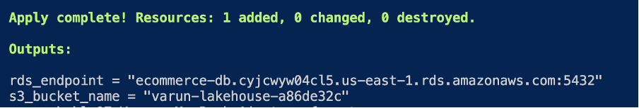

### S3 Endpoint
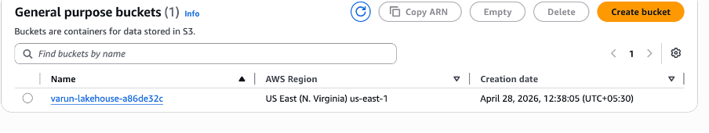
## Phase 1 — CDC with DMS
A real UPDATE runs in Postgres. DMS captures it and writes both the full load file and the delta to S3.

### DMS Endpoints in console
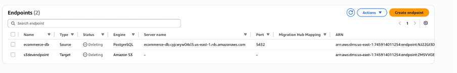
### DMS task in Cli
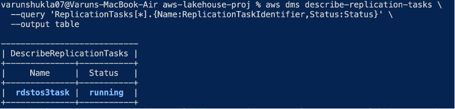

### DB update running
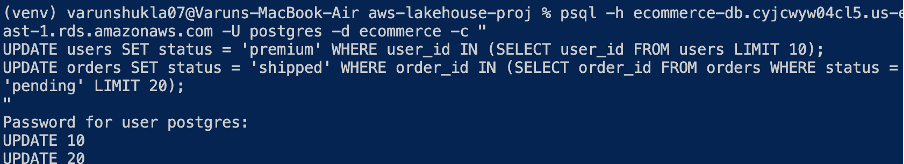

### DMS output in S3 — LOAD + delta files
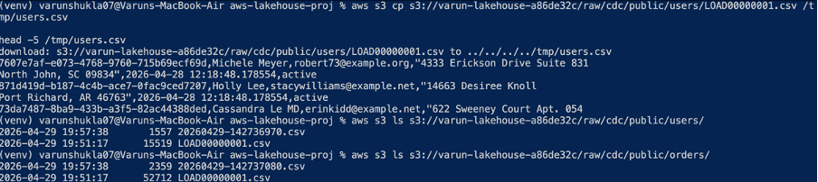

## Phase 2 — Clickstream via Kinesis
Kinesis stream active, Python producer sending events, Firehose delivering GZIP files to S3.

### Kinesis stream active
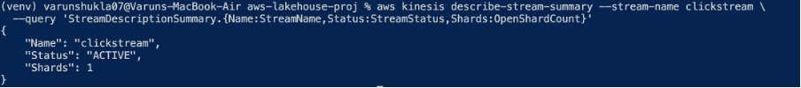

### Glue databases created
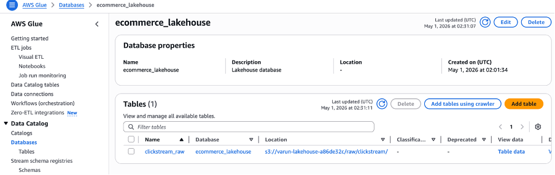

### Python producer sending events
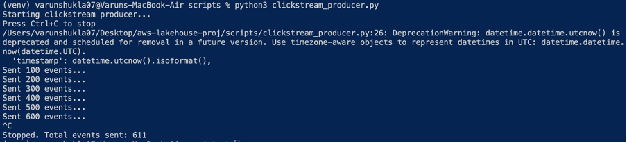

### Clickstream files landing in S3
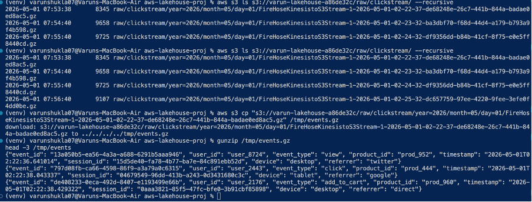

## Phase 3 & 4 — Glue ETL + Iceberg Tables
All three Glue jobs succeed. Iceberg tables are created and populated.

### SCD TYPE 2 for DMS CDC
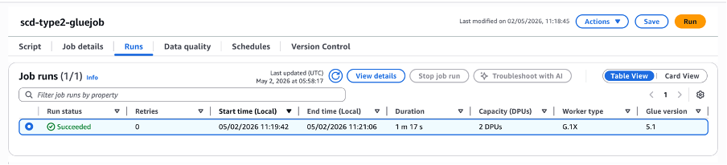

### Clickstream Session Table 
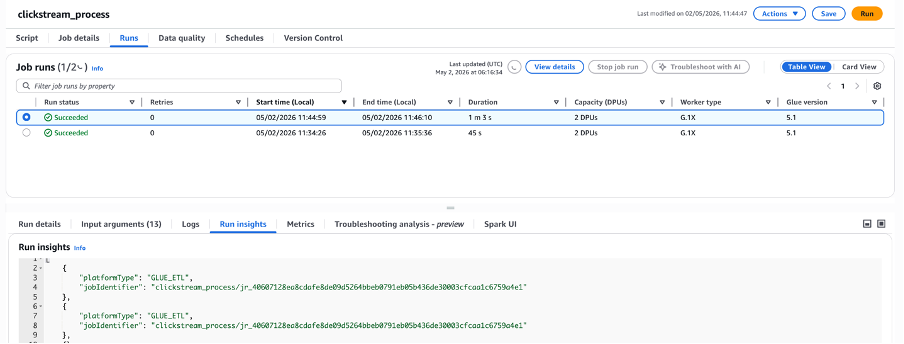

### Fact Table
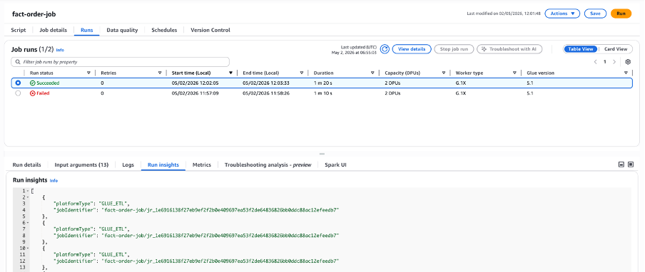

<!-- ### Clickstream files landing in S3

### Clickstream files landing in S3

### Clickstream files landing in S3
 -->

## Phase 5 — Analytics (Athena + Redshift + QuickSight)
Three Athena views created and queried. Redshift Spectrum reads the Iceberg tables. QuickSight dashboards published.

### Daily Revenue View - Athena Query
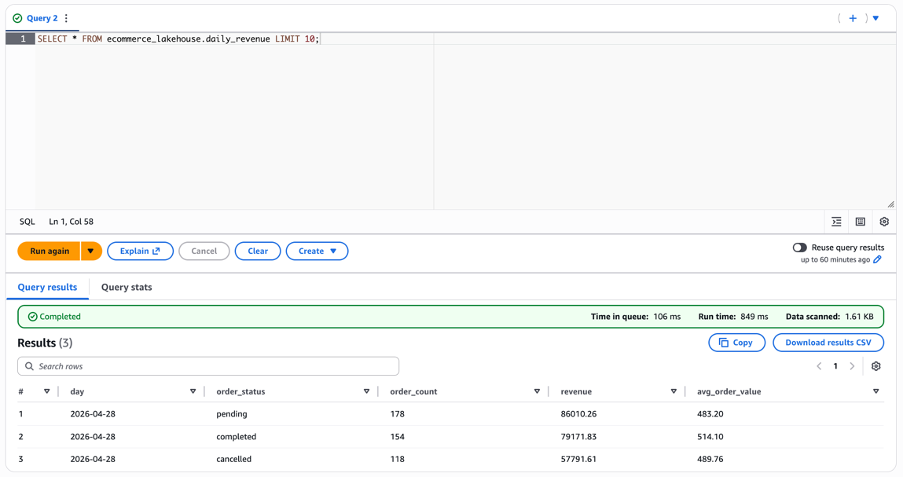
### User Churn View - Athena Query
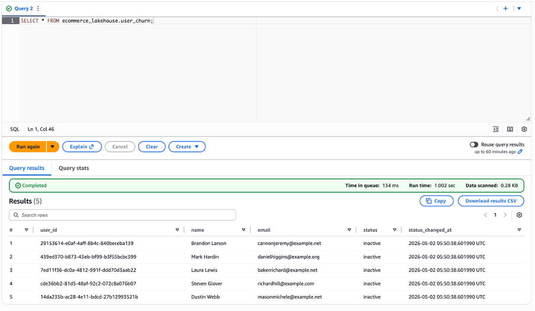
### Conversion Funnel View - Athena Query
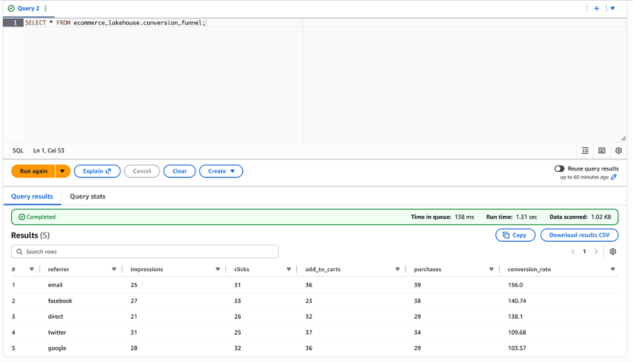

### Daily Revenue - Quicksight Dashboard
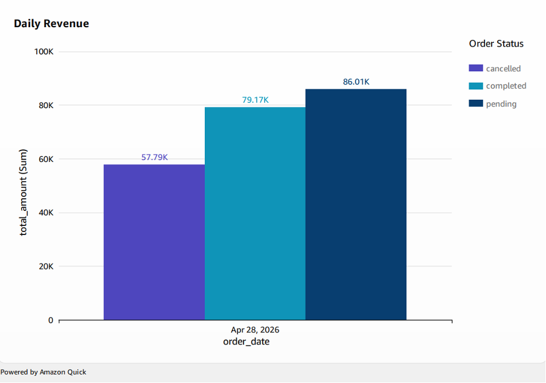

### User Churn - Quicksight Dashboard
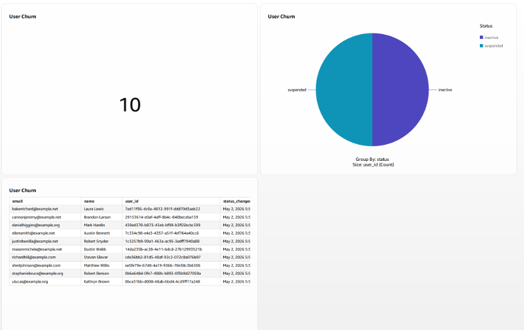

### Conversion Funnel - Quicksight Dashboard
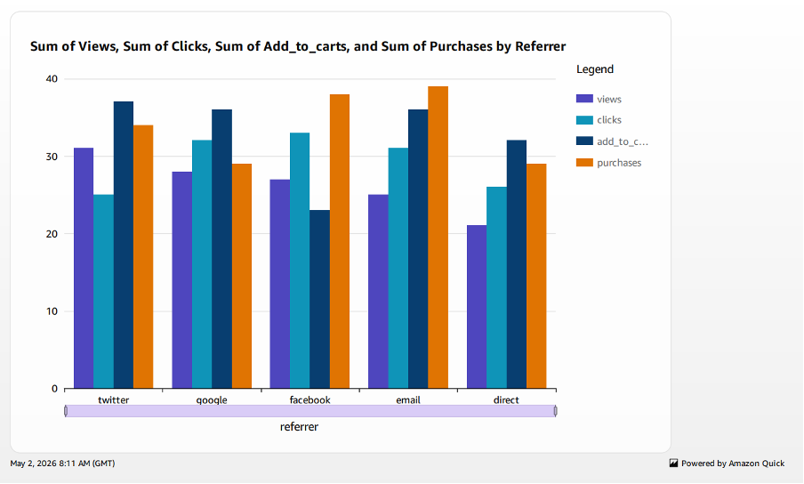

## Phase 6 — Orchestration + Monitoring
Step Functions runs all three jobs in sequence, all green. Glue DQ ruleset runs. CloudWatch alarm is intentionally triggered and recovers.

### Step Functions — execution graph
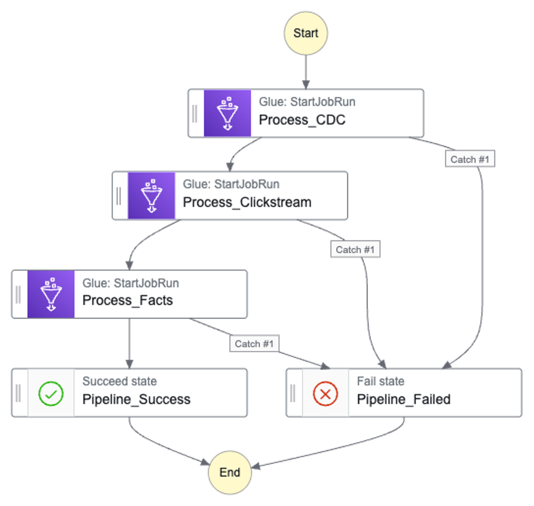

### Step Functions — all green execution
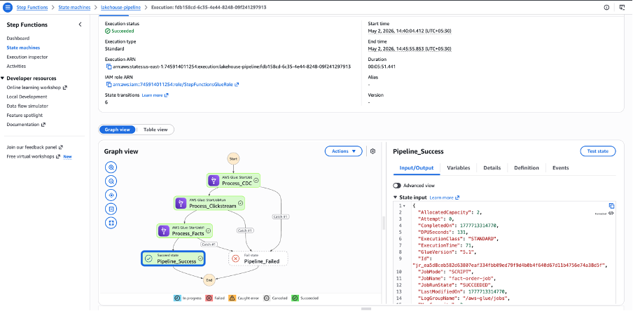

### Glue Data Quality — Ruleset Results
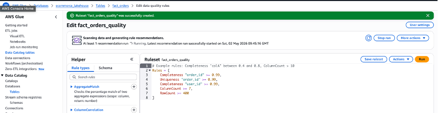

### Testing with CloudWatch alarm + sns: (Setting an alarm for data quality):
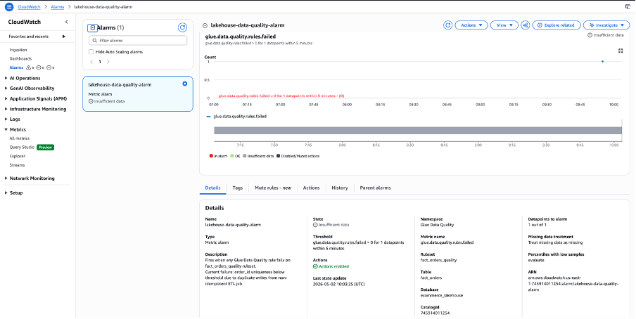

### Data Quality Test:
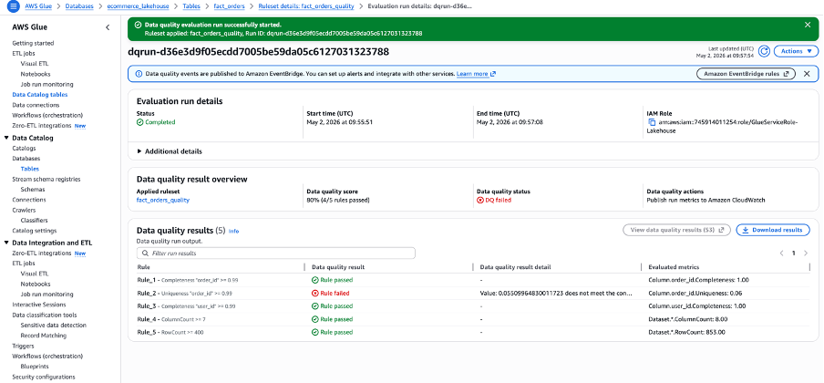

### CloudWatch Alarm Triggered:
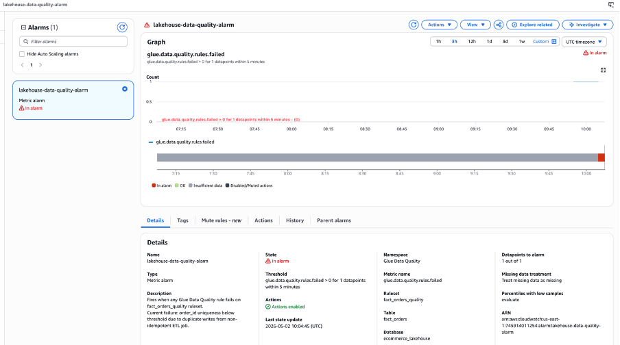

---

## Cost

Total spend for the full project end-to-end: **under $3**.